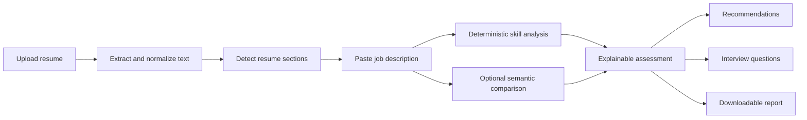
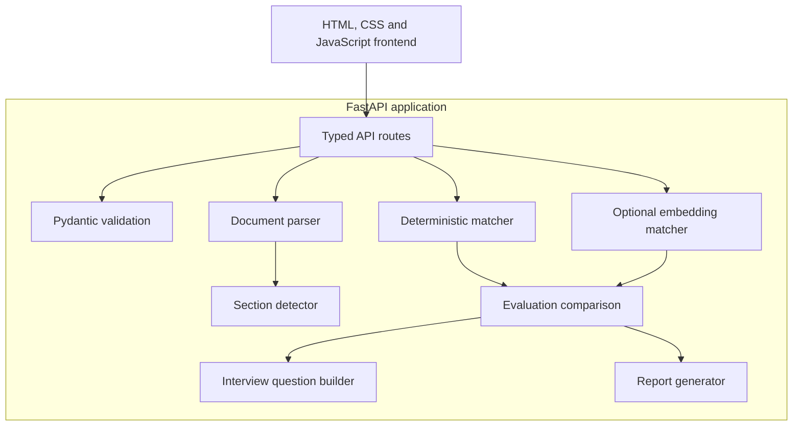

<div align="center">

# CareerCraft AI

### Explainable resume-to-job analysis with actionable skill-gap feedback

Upload a resume, compare it with a job description, understand the score, prepare tailored interview answers, and export the result as a report.

[**Live Application**](https://careercraft-ai-2tcf.onrender.com) ·
[**API Documentation**](https://careercraft-ai-2tcf.onrender.com/docs) ·
[**Report an Issue**](https://github.com/iTulsi/CareerCraft-AI/issues)


[](https://careercraft-ai-2tcf.onrender.com)
[](LICENSE)

</div>

---

## Overview

CareerCraft AI is a deployed full-stack application that compares a candidate's resume with a job description and returns transparent, job-specific feedback.

Rather than presenting an unexplained “ATS score,” CareerCraft separates the analysis into understandable signals:

- job-skill coverage,
- resume-section completeness,
- matched and missing skills,
- optional semantic similarity,
- tailored recommendations,
- interview-practice questions.

The application is built to support better resume decisions. It does not claim to reproduce the private ranking system used by any employer or applicant-tracking platform.

## Live Demo

**Application:**
https://careercraft-ai-2tcf.onrender.com

**Interactive API documentation:**
https://careercraft-ai-2tcf.onrender.com/docs

> The free Render service may take a short time to wake after a period of inactivity.

## What CareerCraft Does

### Resume parsing

- Accepts PDF, DOCX, and TXT resumes.
- Enforces supported file types and a 5 MB upload limit.
- Extracts and normalizes document text.
- Handles common PDF spacing and ligature artifacts.
- Detects standard resume sections from different document layouts.
- Shows the extracted content before analysis.

### Explainable job matching

- Extracts supported skills explicitly requested by the job description.
- Identifies skills found in the resume.
- Separates matched skills from missing skills.
- Measures job-skill coverage.
- Measures resume-section completeness.
- Produces actionable recommendations based on actual gaps.
- Avoids presenting its result as an official employer ATS score.

### Optional semantic comparison

- Uses a pretrained sentence-transformer model when the optional ML dependencies are installed.
- Compares the semantic meaning of the resume and job description.
- Displays semantic similarity separately from deterministic skill coverage.
- Explains the difference between the two matching signals.
- Degrades safely when the semantic model is unavailable.

### Interview preparation

- Generates technical questions from skills already present in the resume.
- Generates learning-gap questions for skills requested by the role but missing from the resume.
- Adds behavioral questions based on detected Projects and Experience sections.
- Provides a structured answer outline for every question.

### Analysis report

- Exports the completed analysis as a downloadable text report.
- Includes scores, matched skills, missing skills, detected sections, recommendations, interview questions, and methodology.
- Validates report payloads before generating a file.
- Returns reports with download-safe response headers.

## Application Workflow



## Scoring Methodology

The deterministic overall assessment uses two visible components:

```text
Overall score = 75% job-skill coverage + 25% resume-section coverage
```

### Job-skill coverage

The application determines which supported skills appear in the job description and checks which of those skills are evidenced in the resume.

```text
Skill coverage = matched requested skills / detected requested skills
```

### Resume-section coverage

The application checks for these core sections:

- Skills
- Experience
- Projects
- Education

```text
Structure coverage = detected core sections / 4
```

### Semantic similarity

Semantic similarity is an optional, separate signal generated by a pretrained embedding model. It is not included in the deterministic overall score because it should first be validated against a sufficiently large, human-reviewed dataset.

## Architecture

CareerCraft uses a deliberately small architecture. FastAPI serves both the API and the static frontend, so the complete product can run as one web service.



## Technology Stack

| Area | Technology |
|---|---|
| Backend | Python, FastAPI, Pydantic |
| Frontend | HTML, CSS, JavaScript |
| PDF parsing | pdfplumber, pypdf |
| DOCX parsing | python-docx |
| File uploads | python-multipart |
| Deterministic matching | Python service layer |
| Optional semantic matching | sentence-transformers |
| Testing | Pytest, HTTPX |
| API documentation | OpenAPI / Swagger UI |
| Deployment | Render |
| License | MIT |

## API Endpoints

| Method | Endpoint | Purpose |
|---|---|---|
| `GET` | `/` | Serve the web application |
| `GET` | `/api/health` | Return service status and version |
| `POST` | `/api/resume/parse` | Parse an uploaded PDF, DOCX, or TXT resume |
| `POST` | `/api/analyze` | Compare resume text with a job description |
| `POST` | `/api/report` | Generate and download an analysis report |
| `GET` | `/docs` | Open interactive API documentation |

## Project Structure

```text
CareerCraft-AI/
├── backend/
│   ├── app/
│   │   ├── main.py
│   │   ├── models.py
│   │   ├── benchmark.py
│   │   ├── report_download.py
│   │   └── services/
│   │       ├── analysis_service.py
│   │       ├── baseline_matcher.py
│   │       ├── benchmark.py
│   │       ├── document_parser.py
│   │       ├── embedding_matcher.py
│   │       ├── evaluation.py
│   │       ├── interview_questions.py
│   │       └── section_parser.py
│   ├── tests/
│   ├── requirements.txt
│   └── requirements-ml.txt
├── data/
│   └── benchmark_sample.csv
├── docs/
│   └── dataset-design.md
├── frontend/
│   ├── index.html
│   └── static/
├── LICENSE
├── Makefile
└── README.md
```

## Run Locally

### Prerequisites

- Python 3.10 or newer
- Git

### 1. Clone the repository

```bash
git clone https://github.com/iTulsi/CareerCraft-AI.git
cd CareerCraft-AI
```

### 2. Create and activate a virtual environment

```bash
python3 -m venv .venv
source .venv/bin/activate
```

### 3. Install the base dependencies

```bash
python -m pip install --upgrade pip
python -m pip install -r backend/requirements.txt
```

### 4. Start the application

```bash
make run
```

Open:

- Application: http://127.0.0.1:8000
- API documentation: http://127.0.0.1:8000/docs
- Health endpoint: http://127.0.0.1:8000/api/health

## Enable Optional Semantic Matching

The sentence-transformer dependency is separated from the lightweight production requirements because it requires additional installation time and memory.

```bash
source .venv/bin/activate
python -m pip install -r backend/requirements-ml.txt
```

Restart the application after installation.

The analysis endpoint can then request semantic comparison using the `include_semantic` field.

## Run Tests

Run the complete automated test suite:

```bash
make test
```

The test suite covers meaningful success and failure paths, including:

- health and frontend routes,
- PDF, DOCX, and TXT parsing,
- malformed and unsupported documents,
- file-size validation,
- request validation,
- deterministic skill matching,
- resume-section assessment,
- semantic-model availability,
- evaluation comparison,
- interview-question generation,
- report generation,
- benchmark input validation.

## Verification

Run the project verification target:

```bash
make verify
```

This performs:

1. Python syntax compilation.
2. The deterministic benchmark.
3. Failure propagation when verification does not pass.

## Benchmarking

CareerCraft contains a benchmark runner for comparing predicted scores with labelled resume/job pairs.

Run the included deterministic smoke-test dataset:

```bash
make benchmark
```

The generated JSON report is written to:

```text
/tmp/careercraft-benchmark.json
```

Run a custom labelled dataset with optional semantic comparison:

```bash
cd backend

../.venv/bin/python -m app.benchmark \
  --dataset ../data/your-labelled-dataset.csv \
  --output /tmp/careercraft-benchmark.json \
  --include-semantic
```

The benchmark reports:

- mean absolute error,
- Pearson correlation,
- Spearman rank correlation,
- per-pair deterministic predictions,
- per-pair semantic predictions when requested.

The included sample is a synthetic smoke-test dataset. Its metrics should not be represented as evidence of broad real-world model quality.

## Production Deployment

CareerCraft is deployed as one Render Web Service.

### Build command

```bash
pip install -r backend/requirements.txt
```

### Start command

```bash
cd backend && uvicorn app.main:app --host 0.0.0.0 --port $PORT
```

### Health-check path

```text
/api/health
```

The lightweight deployment uses deterministic analysis by default. Semantic matching can be enabled on infrastructure with enough memory for the optional model dependencies.

## Design Decisions

### Why deterministic matching remains the baseline

A deterministic baseline is:

- fast,
- inspectable,
- inexpensive to run,
- easy to test,
- useful for identifying explicit skill gaps.

It also gives the project a stable reference point for evaluating more complex matching approaches.

### Why semantic matching is separate

Embedding similarity can find related meaning beyond exact keywords, but a similarity score is not automatically a reliable hiring signal. CareerCraft therefore reports it separately rather than silently blending it into the overall score.

### Why the frontend and backend share one service

The frontend is static and communicates with one FastAPI application. Serving both from one process keeps local development and deployment straightforward without adding an unnecessary second service.

## Current Limitations

- The score is not an official employer ATS score or hiring probability.
- Deterministic matching is limited to the currently supported skill vocabulary.
- Explicit keyword coverage cannot fully measure depth, seniority, or quality of experience.
- Semantic matching requires optional dependencies and additional memory.
- The included benchmark dataset is intentionally small and synthetic.
- The project does not currently provide user accounts, saved analysis history, or collaborative review.
- Export is currently provided as a structured text report rather than a PDF.

## Roadmap

- Expand the reviewed benchmark dataset.
- Improve skill aliases and taxonomy coverage.
- Extract experience-level and education requirements.
- Add stronger evidence linking between resume statements and job requirements.
- Add PDF report export.
- Add privacy controls for stored reports before introducing persistence.
- Evaluate semantic and fine-tuned approaches on human-reviewed labels.
- Add continuous deployment checks for the public service.

## Responsible Use

CareerCraft is intended as a writing and preparation assistant.

Users should:

- add skills only when they can support them truthfully,
- treat missing skills as learning priorities rather than keywords to copy,
- verify extracted resume text before relying on the analysis,
- use the output as one input into their application decisions.

The application should not be used as an automated hiring decision system.

## Contributing

Focused improvements are welcome.

Before opening a pull request:

```bash
make test
make verify
git diff --check
```

Please keep changes small, tested, and clearly explained.

## Author

Built by **[Tulsi Sanskrati Tomar](https://github.com/iTulsi)**.

## License

This project is licensed under the [MIT License](LICENSE).
